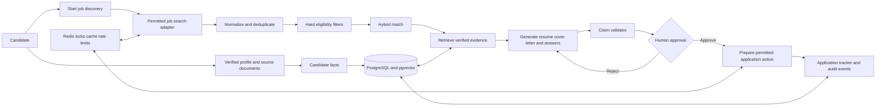

# ApplyFlow Workflow Diagram

## State progression

`CREATED -> SEARCHING -> ANALYZING -> MATCHED -> GENERATING -> VALIDATING -> WAITING_FOR_APPROVAL -> SUBMITTING -> SUBMITTED -> TRACKING`

Recoverable problems move to `RETRYING`; unrecoverable failures move to `FAILED`. The demo implements the safe core path from `CREATED` to `WAITING_FOR_APPROVAL`, then `APPROVED` and a user-confirmed tracking update.

## Trust boundary

Only verified candidate facts are eligible as generation evidence. Generated resumes and letters are outputs, never profile truth. An LLM may request controlled tools, but the backend authorizes, executes, records, and limits every tool action.

